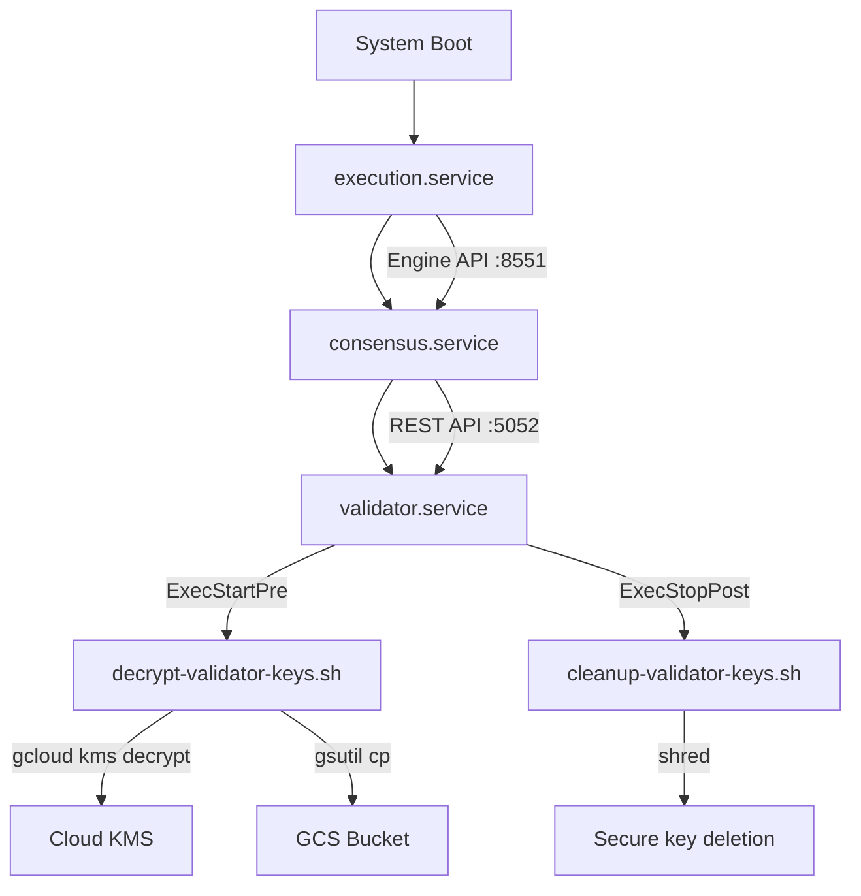

# Architecture

Technical architecture for Ethereum validator deployment using Terraform, Ansible, and GCP infrastructure.

## Infrastructure Flow

```mermaid
graph TD
    subgraph "GCP Project"
        subgraph "VPC: ${local.prefix}-vpc"
            A[VM: ${local.prefix}-vm]
            B[Data Disk: ${local.prefix}-data]
            C[Static External IP]
            D[Firewall Rules]

            C --> A
            A -- Attaches --> B
            D -- Applies to --> A
        end

        subgraph "Cloud Storage"
            E[GCS Bucket: ${local.prefix}-bucket]
        end

        subgraph "Cloud KMS"
            F[Key Ring: ${local.prefix}-keyring]
            G[Crypto Key: ${local.prefix}]
            F --> G
        end

        subgraph "IAM"
            H[Service Account: ${local.prefix}-sa]
        end

        A -- Uses --> H
        H -- Decrypt Access --> G
        H -- Read/Write Access --> E
        G -- Encrypts --> B
        G -- Encrypts --> E
    end

    subgraph "Control Machine (Local)"
        I[Terraform]
        J[Ansible]
    end

    subgraph "Ethereum Network"
        K[Hoodi Testnet]
    end

    I -- "1. Provisions" --> A
    I -- "Provisions" --> E
    I -- "Provisions" --> G
    J -- "2. Configures" --> A
    A -- "3. P2P Communication" --> K
```

**Deployment:** GCP Compute Engine VM with Ansible automation

```
┌─────────────────────────────────────────────────────────────┐
│              GCP VM (Ubuntu 24.04 LTS)                      │
├─────────────────────────────────────────────────────────────┤
│                                                             │
│  ┌──────────────────┐     JWT Auth    ┌────────────────┐    │
│  │   Execution      │◄───────────────►│   Consensus    │    │
│  │   (Nethermind)   │   Engine API    │   (Nimbus)     │    │
│  │   Port 8551      │                 │   Beacon Node  │    │
│  │  • Blockchain DB │                 │                │    │
│  │  • P2P: 30303    │                 │  • P2P: 9000   │    │
│  │  • RPC: 8545     │                 │  • API: 5052   │    │
│  │  • Metrics: 9090 │                 │  • Metrics     │    │
│  └──────────────────┘                 └────────────────┘    │
│         │                                     │             │
│         └─────────────────┬───────────────────┘             │
│                           │                                 │
│                           ▼                                 │
│                  ┌─────────────────┐                        │
│                  │   Validator     │                        │
│                  │   (Nimbus)      │                        │
│                  │                 │                        │
│                  │  • Validator DB │                        │
│                  │  • Keys (enc.)  │                        │
│                  │  • Metrics:8009 │                        │
│                  └─────────────────┘                        │
│                                                             │
│  Storage: /validator (1TB persistent disk)                  │
│  ├─ /validator/nethermind/     (Execution data)             │
│  ├─ /validator/nimbus/          (Consensus data)            │
│  ├─ /validator/nimbus_validator/ (Validator keys)           │
│  └─ /validator/secrets/         (JWT secret)                │
│                                                             │
│  Services: systemd (execution, consensus, validator)        │
│  Security: SSH hardening, UFW firewall, non-root users       │
│  Network: Hoodi testnet (public Ethereum testnet)           │
└─────────────────────────────────────────────────────────────┘
```

## Component Communication

### Execution ↔ Consensus (Engine API)

```
execution.service:8551 ◄──────► consensus.service
      (Nethermind)      JWT Auth     (Nimbus Beacon)

  - Protocol: Engine API (JWT authenticated)
  - JWT Secret: /validator/secrets/jwtsecret (shared)
  - Purpose: Block proposals, payload execution
```

### Consensus ↔ Validator (REST API)

```
consensus.service:5052 ◄──────► validator.service
   (Nimbus Beacon)     REST API    (Nimbus Validator)

  - Protocol: Beacon API (HTTP REST)
  - Purpose: Attestations, validator duties
```

### External Network Access

```
execution.service
  ├─ Port 30303: P2P (TCP/UDP) - Ethereum execution network
  └─ Port 8545: JSON-RPC - Optional external RPC access

consensus.service
  ├─ Port 9000: P2P (TCP/UDP) - Ethereum beacon network
  └─ Port 5052: REST API - Beacon node queries

validator.service
  └─ (No external ports) - Connects to local beacon node only
```

## Security Model

### User Isolation

```
System Groups:
├─ ethereum (GID 988)
│  ├─ execution (UID 999, primary: execution)
│  └─ consensus (UID 996, primary: consensus)
│
├─ execution (GID 991)
│  └─ execution (UID 999)
│
├─ consensus (GID 990)
│  └─ consensus (UID 996)
│
└─ validator (GID 989)
   └─ validator (UID 995)
```

**Access Control:**

- JWT secret: `root:ethereum` (0640) - readable by execution + consensus via group
- Data directories: `owner:owner` (0700) - owner-only access
- Secrets directory: `root:ethereum` (0750) - group-accessible

### Key Encryption Workflow

```
┌─────────────────────────────────────────────────────────┐
│              Validator Key Lifecycle                    │
└─────────────────────────────────────────────────────────┘

1. Key Generation (Off-VM)
   ├─ ethstaker-deposit-cli
   ├─ Output: keystore-*.json + password.txt
   └─ Location: Local machine only

2. Encryption (ansible/scripts/upload-keystore-password.sh)
   ├─ gcloud kms encrypt
   ├─ Key: projects/*/locations/*/keyRings/*/cryptoKeys/eth-validator
   └─ Output: keystore-*.json.enc

3. Storage (GCS)
   ├─ Bucket: gs://eth-validator-bucket/
   ├─ Path: validator-keys/encrypted/
   └─ IAM: Service account decrypt-only access

4. Runtime Decryption (ExecStartPre hook)
   ├─ Download: gsutil cp gs://bucket/* /tmp/
   ├─ Decrypt: gcloud kms decrypt
   ├─ Mount: tmpfs /run/validator-keys (memory-only)
   └─ Permissions: 0600 (validator user only)

5. Service Start
   ├─ Read keys from: /run/validator-keys/
   └─ Load into: nimbus_validator_client memory

6. Service Stop (ExecStopPost hook)
   ├─ shred -vfz -n 10 /run/validator-keys/*
   └─ rm -rf /run/validator-keys/*
```

**Security Properties:**

- ✅ Keys never stored in plaintext on disk
- ✅ Decryption requires GCP service account credentials
- ✅ Memory-only storage (tmpfs) prevents disk forensics
- ✅ Secure deletion (shred) on service stop
- ✅ Audit logs via Cloud KMS activity logs

## Deployment Stages

### Stage 1: Terraform (Infrastructure)

```bash
# terraform/main.tf
module "compute" {
  instance_type    = "n2-standard-8"
  disk_size        = 1TB
  disk_type        = "pd-ssd"
  image            = "ubuntu-2404-lts"
}

module "kms" {
  keyring_name     = "eth-validator-val-keyring"
  key_name         = "eth-validator"
  rotation_period  = "2592000s" # 30 days
}

module "storage" {
  bucket_name      = "eth-validator-bucket"
  location         = "us-central1"
}
```

**Output:**

- Static external IP: `{{ VM_HOST }}`
- Service account with KMS decrypt permissions
- GCS bucket for encrypted keys

### Stage 2: Ansible (Configuration)

```yaml
# ansible/playbooks/deploy_validator.yml
roles:
  - disk_setup # Partition /dev/sdb → /validator
  - system_users # Create execution, consensus, validator users
  - security_hardening # SSH, UFW, fail2ban, unattended-upgrades
  - jwt_secret # Generate shared JWT for Engine API
  - kms_secrets # Install gcloud, deploy key management scripts
  - nethermind # Download, install, configure execution client
  - nimbus # Download, install, configure beacon + validator
  - validator_orchestration # Deploy systemd services, enable on boot
```

**Output:**

- Systemd services configured and enabled
- Data directories with correct ownership (0700)
- Firewall rules applied
- All clients installed and configured

### Stage 3: Service Orchestration

```
Start Sequence:
1. execution.service    (Nethermind)
   ├─ Syncs blockchain from genesis or checkpoint
   ├─ Opens Engine API on :8551 (JWT authenticated)
   └─ Waits for P2P peers

2. consensus.service    (Nimbus Beacon)
   ├─ Depends on: execution.service
   ├─ Connects to execution via Engine API
   ├─ Syncs beacon chain via checkpoint
   └─ Opens REST API on :5052

3. validator.service    (Nimbus Validator)
   ├─ Depends on: consensus.service
   ├─ ExecStartPre: Decrypt keys from GCS → /run/validator-keys/
   ├─ Connects to beacon node REST API
   ├─ Loads validator keys from tmpfs
   └─ Starts attesting and proposing

Stop Sequence:
3. validator.service
   └─ ExecStopPost: Shred and remove decrypted keys

2. consensus.service
   └─ Graceful shutdown (flush state)

1. execution.service
   └─ Graceful shutdown (flush database)
```

## Performance Characteristics

### Resource Usage (Steady State)

```
Component         CPU    RAM      Disk I/O    Network
────────────────────────────────────────────────────────
Nethermind        2-4    8-12GB   50-100MB/s  5-10MB/s
Nimbus Beacon     1-2    4-6GB    20-50MB/s   2-5MB/s
Nimbus Validator  0.5    1-2GB    <5MB/s      <1MB/s
────────────────────────────────────────────────────────
Total             4-7    13-20GB  70-155MB/s  7-15MB/s
```

### Sync Times (Hoodi Testnet)

```
Execution Layer (Nethermind):
  ├─ Initial sync: 2-4 hours (snap sync)
  └─ Database size: ~400GB after 6 months

Consensus Layer (Nimbus):
  ├─ Checkpoint sync: 5-15 minutes
  ├─ Backfill: 1-2 hours (optional)
  └─ Database size: ~150GB after 6 months
```

### Disk Usage Growth

```
Month 0:  ~50GB  (Fresh sync)
Month 1:  ~120GB (Execution DB growth)
Month 3:  ~220GB
Month 6:  ~380GB
Month 12: ~550GB (approaching 1TB limit)

Recommendation: 1TB disk for 12+ month operation
```

## Network Architecture

### Firewall Rules (UFW)

```
Port      Protocol  Source      Purpose
─────────────────────────────────────────────────────
22        TCP       0.0.0.0/0   SSH (with fail2ban)
30303     TCP/UDP   0.0.0.0/0   Execution P2P
9000      TCP/UDP   0.0.0.0/0   Consensus P2P
8545      TCP       127.0.0.1   JSON-RPC (local only)
8551      TCP       127.0.0.1   Engine API (local only)
5052      TCP       127.0.0.1   Beacon API (local only)
8008      TCP       127.0.0.1   Beacon metrics (local only)
8009      TCP       127.0.0.1   Validator metrics (local only)
```

**Security Notes:**

- P2P ports exposed for peer discovery
- RPC/API ports bound to localhost only
- Metrics endpoints not externally accessible
- SSH protected by key-only authentication

### Service Dependencies



## Monitoring Integration Points

### Metrics Exporters

```
Nethermind (Prometheus):
  - Endpoint: http://localhost:9090/metrics
  - Metrics: sync status, peer count, gas price, block processing

Nimbus Beacon (Prometheus):
  - Endpoint: http://localhost:8008/metrics
  - Metrics: head slot, finalized epoch, peer count, attestation performance

Nimbus Validator (Prometheus):
  - Endpoint: http://localhost:8009/metrics
  - Metrics: validator status, balance, attestation success rate
```

### Log Aggregation

```
All services log to systemd journal:
  - journalctl -u execution
  - journalctl -u consensus
  - journalctl -u validator

Key management logs tagged:
  - journalctl -t validator-keys
```

### Health Check Endpoints

```bash
# Execution sync status
curl -X POST -H "Content-Type: application/json" \
  --data '{"jsonrpc":"2.0","method":"eth_syncing","params":[],"id":1}' \
  http://localhost:8545

# Consensus sync status
curl http://localhost:5052/eth/v1/node/syncing

# Validator status
curl http://localhost:5052/eth/v1/beacon/states/head/validators/0x<pubkey>
```

## Design Decisions

### Why Ansible over Kubernetes?

- **Simplicity**: Single VM deployment, no orchestration overhead
- **Resource efficiency**: No control plane resource usage
- **Direct systemd integration**: Mature, battle-tested service management
- **Challenge constraint**: "Minimal dependencies" requirement
- **Production path**: Ansible roles → Kubernetes manifests (see PRODUCTION.md)

### Why Nethermind + Nimbus?

- **Nethermind**: Production-ready execution client, excellent sync performance
- **Nimbus**: Low resource usage (<4GB RAM), Rust-based reliability
- **Client diversity**: Different teams, reduces systemic risk
- **Active development**: Regular updates, responsive maintainers

### Why tmpfs for Decrypted Keys?

- **Security**: Never written to persistent disk
- **Performance**: RAM-based, no I/O overhead
- **Forensics**: Keys cannot be recovered from disk after shutdown
- **Compliance**: Meets PCI-DSS data retention requirements

## Scalability Considerations

### Current Limitations (Single VM)

- **SPOF**: Single point of failure (VM, disk, network)
- **Vertical scaling only**: Can't scale horizontally
- **Manual failover**: Requires operator intervention
- **No load balancing**: Single RPC endpoint

### Migration Path to Production

See [PRODUCTION.md](PRODUCTION.md) for:

- Kubernetes deployment architecture
- Multi-region validator deployment
- HA execution/consensus clients
- GitOps with ArgoCD
- Observability stack (Prometheus + Grafana)
