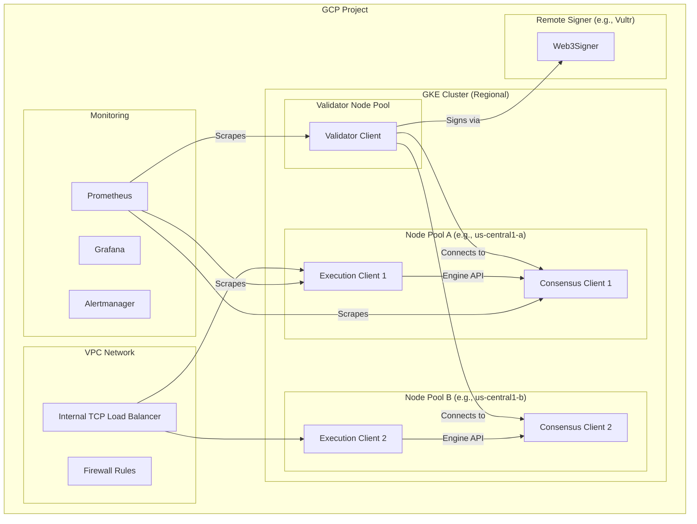

# Production Deployment Guide

This document outlines the architecture and steps for migrating the single-VM Ethereum validator to a highly available, production-grade deployment on Google Kubernetes Engine (GKE).

## 1. Production Architecture

The production architecture is designed for high availability, security, and scalability, using Kubernetes to orchestrate the validator components.

### High-Level Diagram



### Key Components

-   **GKE Cluster**: A regional cluster with multiple node pools across different zones for high availability.
-   **Execution Clients**: A stateful set of execution clients (e.g., Nethermind) with persistent volumes for blockchain data.
-   **Consensus Clients**: A stateful set of consensus clients (e.g., Nimbus) that connect to the execution clients.
-   **Validator Client**: A deployment for the validator client (e.g., Nimbus) that connects to the consensus clients.
-   **Remote Signer**: A secure, external service (like Web3Signer) that holds the validator keys and signs attestations and proposals. This keeps the keys off the Kubernetes cluster.
-   **Load Balancer**: An internal TCP load balancer to distribute RPC traffic across the execution clients.
-   **Monitoring**: A dedicated monitoring stack with Prometheus, Grafana, and Alertmanager to track the health of the validator.

## 2. Prerequisites

-   A Google Cloud project with billing enabled.
-   `gcloud`, `kubectl`, and `helm` CLIs installed and configured.
-   A GKE cluster with at least two node pools in different zones.
-   A secure, external server for the remote signer.

## 3. Deployment Steps

### Step 1: Set Up the GKE Cluster

Create a regional GKE cluster with at least two node pools.

```bash
gcloud container clusters create eth-validator-cluster \
  --region us-central1 \
  --num-nodes 1 \
  --node-locations us-central1-a,us-central1-b \
  --machine-type n2-standard-8 \
  --disk-type pd-ssd \
  --disk-size 1TB
```

### Step 2: Deploy the Clients

Use Helm charts or Kubernetes manifests to deploy the execution, consensus, and validator clients.

**Example (using Helm):**

```bash
# Add Helm repositories for the clients
helm repo add nethermind '...'
helm repo add nimbus '...'

# Deploy the execution clients
helm install execution-clients nethermind/nethermind \
  --set replicaCount=2 \
  --set persistence.size=1Ti

# Deploy the consensus clients
helm install consensus-clients nimbus/nimbus \
  --set replicaCount=2 \
  --set executionEndpoint=http://execution-clients:8551

# Deploy the validator client
helm install validator-client nimbus/validator \
  --set consensusEndpoint=http://consensus-clients:5052 \
  --set remoteSignerUrl=http://<your-remote-signer-ip>:9000
```

### Step 3: Set Up the Remote Signer

Install and configure a remote signer (e.g., Web3Signer) on a secure, external server.

1.  **Install Web3Signer**: Follow the official documentation to install Web3Signer.
2.  **Import Validator Keys**: Securely import your validator keys into Web3Signer.
3.  **Configure Slashing Protection**: Set up a slashing protection database.
4.  **Expose the API**: Expose the Web3Signer API on a secure endpoint.

### Step 4: Configure Monitoring and Alerting

Deploy Prometheus, Grafana, and Alertmanager to monitor the validator.

```bash
# Add the Prometheus community Helm repository
helm repo add prometheus-community https://prometheus-community.github.io/helm-charts

# Deploy the monitoring stack
helm install monitoring prometheus-community/kube-prometheus-stack
```

## 4. Security Considerations

-   **Network Policies**: Use Kubernetes network policies to restrict traffic between pods. Only allow the necessary connections (e.g., validator to consensus, consensus to execution).
-   **Remote Signer**: The remote signer is the most critical component to secure. Use a hardened server, a firewall, and a dedicated VPN for the connection between the validator client and the signer.
-   **RBAC**: Use Kubernetes RBAC to restrict access to the cluster.
-   **Secrets Management**: Use a secrets management solution like Google Secret Manager or HashiCorp Vault to store sensitive information.

## 5. Monitoring and Alerting

### Key Metrics to Monitor

-   **Validator Balance**: `eth2_validator_balance_gwei`
-   **Attestation Performance**: `eth2_validator_attestation_effectiveness`
-   **Missed Attestations**: `eth2_validator_missed_attestations_total`
-   **Proposed Blocks**: `eth2_validator_proposed_blocks_total`
-   **Execution/Consensus Client Sync Status**: `eth_execution_sync_status`, `eth_consensus_sync_status`

### Recommended Alerts

-   **Validator Down**: Alert if the validator client is not running.
-   **Missed Attestations**: Alert if the number of missed attestations exceeds a threshold.
-   **Low Balance**: Alert if the validator balance drops below a certain level.
-   **Client Not Synced**: Alert if the execution or consensus clients are not synced.

## 6. Backup and Recovery

-   **Validator Keys**: The validator keys are stored in the remote signer. Back up the signer's configuration and key files to a secure, offline location.
-   **Slashing Protection**: The slashing protection database is critical. Back it up regularly to prevent slashing.
-   **GKE Cluster**: The GKE cluster is stateless. If it fails, you can recreate it and redeploy the clients.

## 7. Cost Management

-   **Use Spot VMs**: Use GKE's spot VMs for the execution and consensus client node pools to reduce costs.
-   **Right-Size Instances**: Monitor resource usage and adjust the machine types of the node pools as needed.
-   **Set Budgets**: Use Google Cloud's budgeting and alerting features to monitor your spending.
